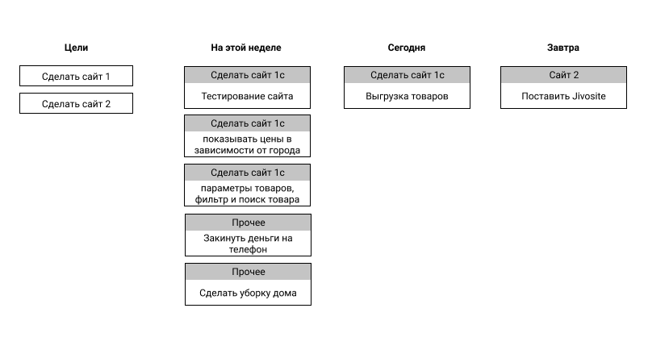
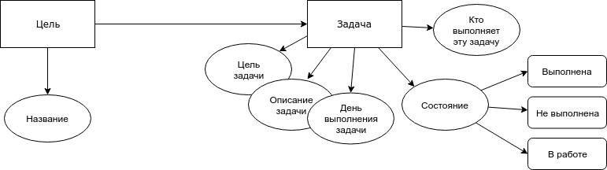
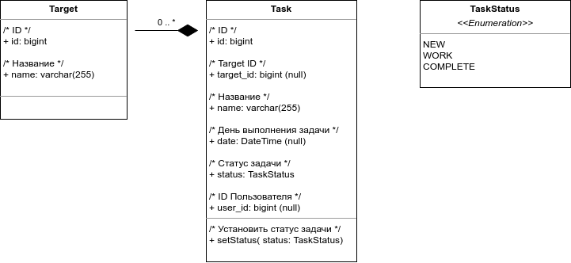

# Доска текущих задач

Сделать веб интерфейс на VueJS и бэкенд на python asyncio. Доска, на которой можно создавать задачи и перетаскивать их.

**Цели** - это то, что нужно сделать в ближайшем будущем.

**Задачи** - это итерации, которые ведут к цели.

**Параметры задачи:**

- Описание задачи что нужно сделать.
- Цель этой задачи (Если есть)
- День, когда будет выполняться эта задача




## Сетевая модель




## Диаграмма состояний


Возможные состояния системы:
- новая задача
- задача в работе
- задача выполнена


## Диаграмма классов




Классы:
- Target - цели
- Task - задачи
- TaskStatus - статусы задач


## API

### Создание цели

**Запрос**
```
/api/target/create
{
"data":
  {
    "name": "Название цели"
  },
}
Создание цели
{
  "data":
  {
    "id": 10,
    "name": "Новое название цели"
  },
  "error":
  {
    "message": "",
    "class_name": "",
  }
}
```

**Ответ**

```
{
  "data":
  {
    "id": 10,
    "name": "Новое название цели"
  },
  "error":
  {
    "message": "",
    "class_name": "",
  }
}
```


### Редактирование цели

**Запрос**
```
/api/target/10/edit
{
"data":
  {
    "name": "Новое название цели"
  },
}
```

**Ответ**
```
{
  "data":
  {
    "id": 10,
    "name": "Новое название цели"
  },
  "error":
  {
    "message": "",
    "class_name": "",
  }
}
```


### Удалить цель

**Запрос**
```
/api/target/10/delete
```

**Ответ**
```
{
  "data":
  {
    "id": 10,
    "name": "Новое название цели"
  },
  "error":
  {
    "message": "",
    "class_name": "",
  }
}
```


### Запрос данных

**Запрос**
```
/api/target/
{
  "filter":
  [
    {
      "field": "is_deleted",
      "op": "=",
      "value": 0,
    },
  ],
}
```

**Ответ**
```
{
  "data":
  [
    {
      "id": 10,
      "name": "Новое название цели"
    },
	{
      "id": 11,
      "name": "Новое название цели"
    },
	{
      "id": 12,
      "name": "Новое название цели"
    },
  ],
  "error":
  {
    "message": "",
    "class_name": "",
  }
}
```


### Создание задачи

**Запрос**
```
/api/task/create
{
  "data":
  {
    "name": "Новая задача",
    "target_id": 10,
    "date": 1626965799,
	"status": "NEW",
	"user_id": null,
  },
}
```

**Ответ**
```
{
  "data":
  {
    "id": 21,
    "name": "Новая задача",
    "target_id": 10,
    "date": 1626965799,
	"status": "NEW",
	"user_id": null,
  },
  "error":
  {
    "message": "",
    "class_name": "",
  }
}
```


### Редактирование задачи

**Запрос**
```
/api/task/21/edit
{
"data":
  {
    "name": "Новое название задачи"
  },
}
```

**Ответ**
```
{
  "data":
  {
    "id": 21,
    "name": "Новое название задачи",
    "target_id": 10,
    "date": 1626965799,
    "status": "NEW",
    "user_id": null,
  },
  "error":
  {
    "message": "",
    "class_name": "",
  }
}
```


### Удаление задачи

**Запрос**
```
/api/task/21/delete
```

**Ответ**
```
{
  "data":
  {
    "id": 21,
    "name": "Новое название задачи",
    "target_id": 10,
    "date": 1626965799,
    "status": "NEW",
    "user_id": null,
  },
  "error":
  {
    "message": "",
    "class_name": "",
  }
}
```


### Поиск задач

**Запрос**
```
/api/task/
{
  "filter":
  [
    {
      "field": "is_deleted",
      "op": "=",
      "value": 0,
    },
	{
      "field": "status",
      "op": "=",
      "value": "NEW",
    },
  ],
}

```
**Ответ**
```
{
  "data":
  {
    "id": 21,
    "name": "Новое название задачи",
    "target_id": 10,
    "date": 1626965799,
    "status": "NEW",
    "user_id": null,
  },
  "error":
  {
    "message": "",
    "class_name": "",
  }
}
```