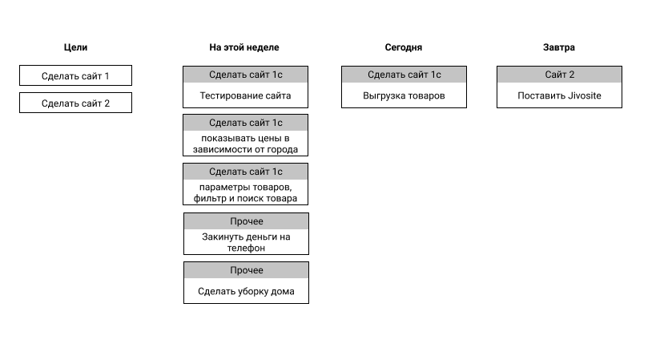
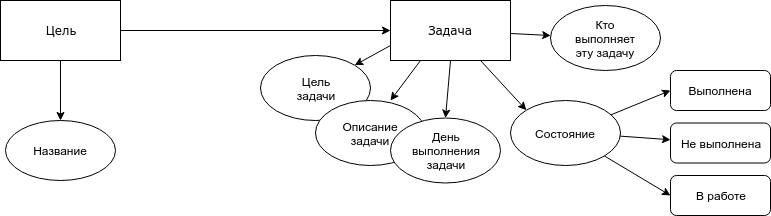
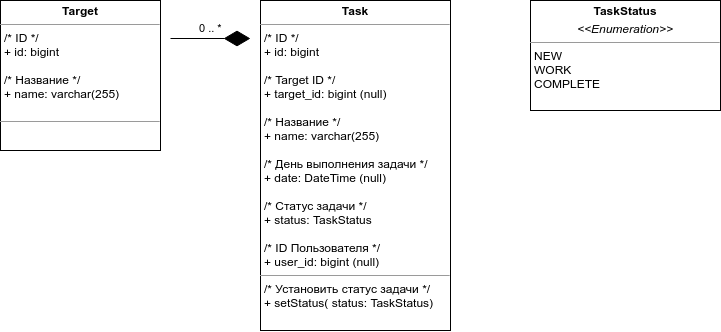
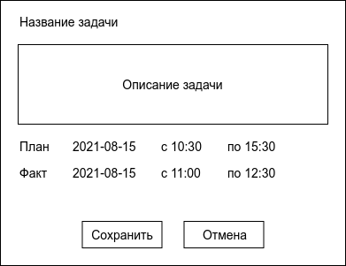

# Доска текущих задач

Сделать веб интерфейс на VueJS и бэкенд на python asyncio. Доска, на которой можно создавать задачи и перетаскивать их.

**Цели** - это то, что нужно сделать в ближайшем будущем.

**Задачи** - это итерации, которые ведут к цели.

**Параметры задачи:**

- Описание задачи что нужно сделать.
- Цель этой задачи (Если есть)
- День, когда будет выполняться эта задача

## Сетевая модель

## Диаграмма состояний

Возможные состояния системы:
- 0 - новая задача
- 1 - задача в работе
- 2 - задача выполнена

## Диаграмма классов

**Классы:**
- Target - цели
- Task - задачи
- TaskStatus - статусы задач

## Редактирование задачи

**Параметры задачи:**
- название задачи
- описание задачи
- дата и время начала задачи по плану
- дата и время окончания задачи по плану
- дата и время начала задачи по фактическое
- дата и время окончания задачи по фактическое
- статус задачи:
  - 0 - новая задача
  - 1 - в работе
  - 2 - выполнена
- Цвет задачи

**Таблица tasks в базе данных:**

| Столбец           | Тип              | Комментарий      |
| ----------------- | ---------------- | ---------------- |
| id                | bigint(20)       |
| target_id         | bigint(20) NULL  | ID Цели
| user_id           | bigint(20) NULL  | ID Пользователя
| status            | tinyint [0]      | Статус
| name              | varchar(255)     | Название
| description       | text             | Описание
| rgb_color         | char(6) [ffffff] | Цвет
| gmdate_plan_begin | datetime NULL    | 
| gmdate_plan_end   | datetime NULL    |
| gmdate_work_begin | datetime NULL    |
| gmdate_work_end   | datetime NULL    |
| work_hours        | int [0]          | Сколько затрачено часов
| pos               | int [0]          | Позиция в списке

1. Поле work_hours должно рассчитываться автоматически на основе значений gmdate_work_begin и gmdate_work_end.
2. gmdate_plan_end должно быть больше чем gmdate_plan_begin
3. gmdate_work_end должно быть больше чем gmdate_work_begin
4. gmdate_plan может быть равным null. Тогда нужно учитывать поле gmdate_work